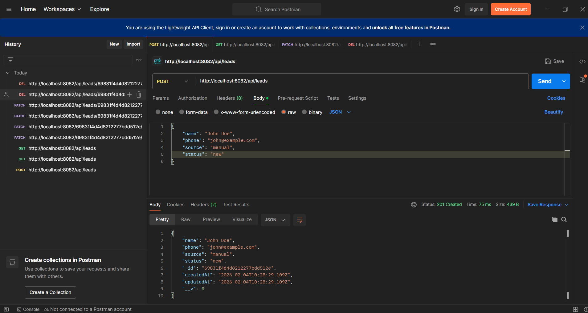
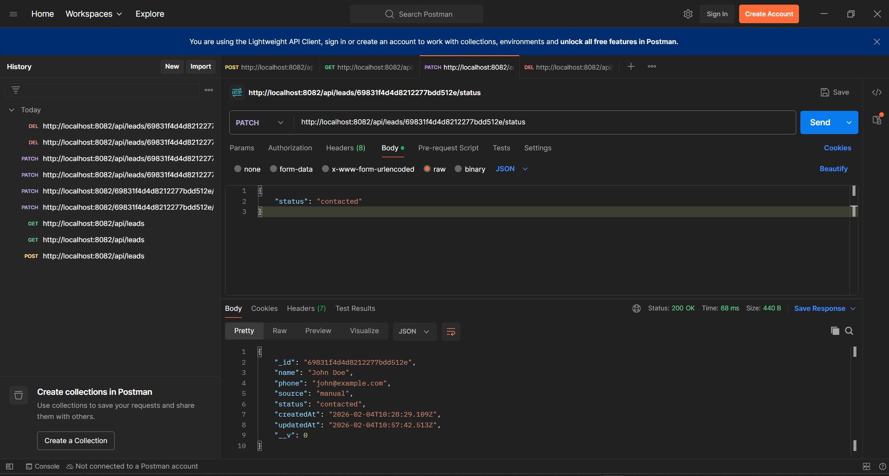
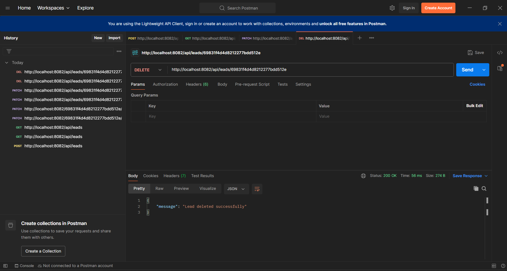

## TASK - 1: Environment and skeleton Task

## Table of Contents:
  - Screenshots
  - Installation & Setup

## Screenshots
Frontend Home Page:

Backend:

## Installation & Setup

### 1. Clone the repository
      git clone 
      cd lead_managment

### 2. Backend Setup
      cd backend
      npm install
      
- Create a .env file in the backend directory
- Add: MONGO_URI=your_mongodb_uri, PORT=8082

### 3. Frontend Setup
     cd ../frontend
     npm install

## Running the App
1. **Start Backend:** `cd backend && npm start` (or `npm start` with nodemon)
2. **Start Frontend:** `cd frontend && npm start` (or `npm run dev` for Vite)

---

## TASK - 2 (Backend CRUD)

## Table of Contents:
  - Screenshots (POSTMAN)

## Screenshots (POSTMAN)
Create Lead:

Get Leads:

Update Lead Status:

Delete Lead:

---

## TASK - 3

Leads table and Add Leads:

https://github.com/user-attachments/assets/8a00706f-b331-4ad4-a232-c20fdf2ab40e

